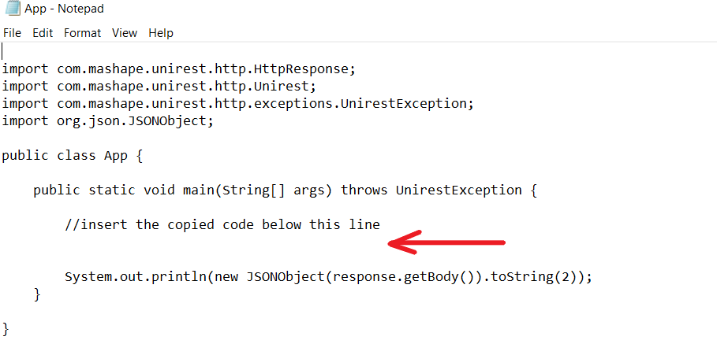

# basic-Java-Postman-App


## Requirements

Building the client library requires:
1. Java 1.8 or higher [Installation][1]
2. Gradle [Installation][2]

[1]: https://www.oracle.com/java/technologies/javase-downloads.html
[2]: https://gradle.org/install/

> ⚠️  _If you also have JRE installed, create a new environment variable for Java and set a new path for the PATH environment to the JDK folder in "Program Files". Guides for creating and setting a new path: [Windows][3] / [Unix][4] / [MacOS][5]._
>
[3]: https://stackoverflow.com/a/35623142
[4]: https://linuxize.com/post/how-to-set-and-list-environment-variables-in-linux/?__cf_chl_managed_tk__=2d828b14fa177654a647a55ddfd6c806684ba724-1623071966-0-AQljDh9QvmnbGDiK9JEyOIzDsAnC1zFP3J8sHt1Rq5PuJ6vmiibCZCiYTQF1w-VaFoGl2Xp0uOYGFGH7uaNxWbX-S7qW84E3xKzPpdm2g1alzFj3X-mlJGemcio1_AcmIw1T1P_SjgjqhTWCRjTV6-aw39KSFnFtNmcori6DHk9fiRCPHFJWiqJ8bE5Ps4Z0BW0SLQ0M08ZI_-zne14-sqX6I0VyKLPh_43Y8U_KQPgVpSHvPyh2hhPmEWmrymHEzTb9fC2qNwtHXI81nbqj2s8BiilvJ-NAhFB7dQ4_nwY7hCOda0XP6fSicXuBHKrJChBE4ynd_7Kk1BJizfvB0zAx5OCxKPGJTJCiLHKj4Ompnrxb229jpGc6p4JfBd9Oz-J-7HAN81SAQxyONgSGp5fYGSGzedoL5jOgioCIoQvTq0ce3hFDGpBaz1ShHym71eixeNjJAk2m7cNHVwSfhqM-jAUPRFANj_QLIzuwkxy_pdb3kZ5mH1GzKT0gXH_rfMSctm8-PkHn0Yzgjr3ne8I9de0df7-8EOA53Qw5Zq0Ed6Yw-evxD7TJuFKspdjUe6ZdbdsmrjHgPZl7WBaNKGhNDpHZxWRA_R5TDqH57oqtngzMW8IsEwQSXmIZToWCoU4SM15_D2SL_SNU2OAwslmmg0-8z8fMQ9nC4MvIDB_RAubUFonkPL60VTu10xg4XmahsxBbF8SNKe_INR0bLBOLZmVA0ijhD_h1-UusutbdarDHKuxaursdW6Jb8gcn3A
[5]: https://apple.stackexchange.com/a/229941

## Installation

To copy the API client to your computer copy link of the repository, open Command Prompt, go to the location where project will be copied and execute git clone command:

```shell
git clone https://github.com/kyriba/dev-portal-basic-Java-Postman-App-sample.git
```

Open the project folder via command prompt, for example:

```shell
cd basic-Java-Postman-App
```

Select the desired Collection in Postman, authenticate through "Get token." request and run the request that you want to provide in the Application. 

If the request works, copy code from Postman:


In "Code snippet", proceed to the dropdown list with different programming languages, where "cURL" is set by default, and choose "Java - OkHttp" from the list. There, copy the snippet to clipboard:


Open the .../src/main/java/App.java file and input your piece of code:




Run the project in Terminal in the root folder of cloned app:
```shell
gradle run
```

If everything was done accordingly with provided steps, you will get the result printed in the command prompt.